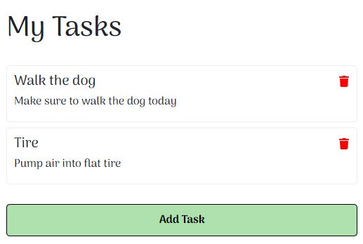
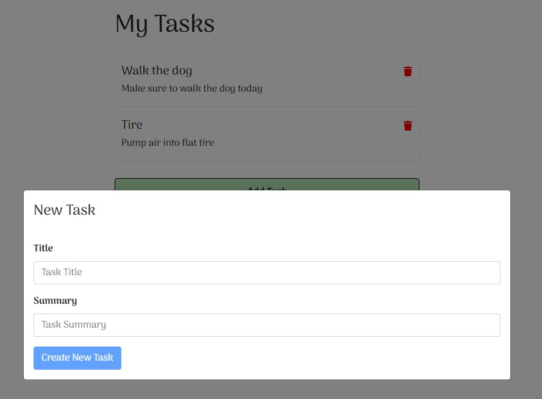

# Todo App

## Introduction

A simple todo application written using React along with json-server to simulate a REST API.
Utilized react-toastify to display toast notifications in a stylish manner.
Built each component with it's own scss file.
Styling is done with the use of Sass and BEM naming conventions.
Implemented react-bootstrap to create form modal.

## Screen Shot

## Technologies Used

- React
- React-Bootstrap
- React-Toastify
- JSON-Server
- Sass

## Installation

- Clone repository or download zip file
- Open two terminal windows
- In first terminal window, run `npm install` to get all dependencies
- In second terminal window, type `json-server --watch tasks.json --port 8080` to start json-server

## Learn More

You can learn more in the [Create React App documentation](https://facebook.github.io/create-react-app/docs/getting-started).

To learn React, check out the [React documentation](https://reactjs.org/).

### Code Splitting

This section has moved here: [https://facebook.github.io/create-react-app/docs/code-splitting](https://facebook.github.io/create-react-app/docs/code-splitting)

### Analyzing the Bundle Size

This section has moved here: [https://facebook.github.io/create-react-app/docs/analyzing-the-bundle-size](https://facebook.github.io/create-react-app/docs/analyzing-the-bundle-size)

### Making a Progressive Web App

This section has moved here: [https://facebook.github.io/create-react-app/docs/making-a-progressive-web-app](https://facebook.github.io/create-react-app/docs/making-a-progressive-web-app)

### Advanced Configuration

This section has moved here: [https://facebook.github.io/create-react-app/docs/advanced-configuration](https://facebook.github.io/create-react-app/docs/advanced-configuration)

### Deployment

This section has moved here: [https://facebook.github.io/create-react-app/docs/deployment](https://facebook.github.io/create-react-app/docs/deployment)

### `npm run build` fails to minify

This section has moved here: [https://facebook.github.io/create-react-app/docs/troubleshooting#npm-run-build-fails-to-minify](https://facebook.github.io/create-react-app/docs/troubleshooting#npm-run-build-fails-to-minify)
